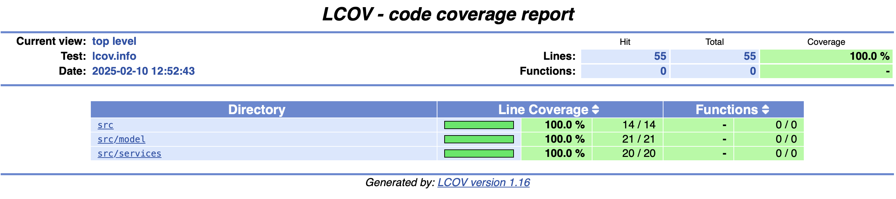

# **Email Sanity**

A robust Flutter package designed to provide enhanced email validation with additional layers of accuracy and reliability. Building on the foundation of the popular [email_validator](https://pub.dev/packages/email_validator) package, EmailSanity introduces extra "magic" to ensure that the emails you process are not just syntactically correct, but also contextually appropriate and ready for real-world use.

It validates the email syntax and checks as well as the domains to ensure the email provided is accurate.

**Email Providers Being Checked:**

1. Google
2. Yahoo
3. Microsoft
4. Apple
5. Yandex
6. Fastmail


## **Usage**

### Basic Validation

```Dart
void main() {
    var email = "email@gmail.com";
    assert(EmailSanity.validate(email));
}
```

### Validation with Details

```Dart
void main() {
    var email = "email@gmail.com";
    var result = EmailSanity.validateWithDetails(email, locale: 'es'); // add optional locale (defaults to en)
    print('Is valid: ${result.isValid}');
    print('Error message: ${result.errorMessage}');
}
```

#### Test Coverage Report

