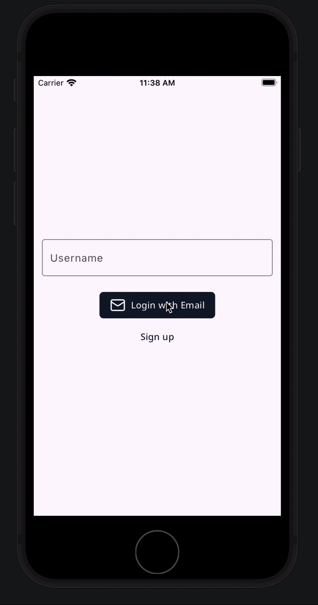

# **Email Sanity**

A robust Flutter package designed to provide enhanced email validation with additional layers of accuracy and reliability. Building on the foundation of the popular email_validator package, EmailSanity introduces extra "magic" to ensure that the emails you process are not just syntactically correct, but also contextually appropriate and ready for real-world use.

It validates the email syntax and checks as well as the domains to ensure the email provided is accurate.

**Email Providers Being Checked:**

1. Google
2. Yahoo
3. Microsoft
4. Apple
5. Yandex
6. Fastmail



## **Installation**

### 1. Add Package

Add this to your package's `pubspec.yaml` file:

```yaml
dependencies:
  email_sanity: '^0.0.1'
```

#### 2. Run Pub Get

```bash
$ pub get
..
```


#### 3. Import Email Sanity

```Dart
import 'package:email_sanity/email_sanity.dart';
```

## **Usage**

```Dart
void main() {

    var email = "email@gmail.com";

    assert(EmailSanity.validate(email));
}
```